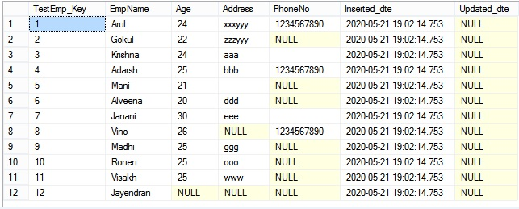
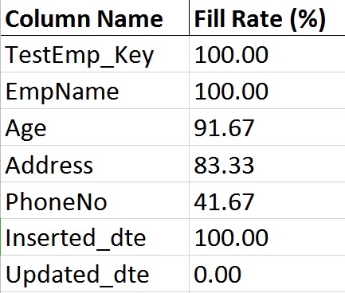

# Finding Fill Rate of Table :slightly_smiling_face:

### Introduction
The Fill Rate is one of the most important metric in many of the business related decisions. So Knowing Fill Rate is one of the essential tasks in Data Analysis Processes.

To easily find the Fill Rate of a table, we can use this Stored Procedure - **Get_FillRate** that is applicable to run in both **AZURE SQL Databases** as well as **On-Premises SQL Databases**.

### Sample Table

### Output Result Set of Get_FillRate SP

### Scenario
Observing Fill Rate is the key factor for knowing and improving data quality that creates the fulfilment to both our management as well as our end users. Need to find Fill Rate of a Table, How to do it?

### What is meant by Fill Rate?
The Fill Rate is defined as the collection of filled entries at each Column level that is divided by the total number of rows in the table. Depends on the total number of rows that is present in a table, we can figure out the Fill Rate easily.

### Challenges
The Schema changes like below things makes our Fill Rate approach little difficult than actual.
* Table name changes
* Column name changes
* Data type changes
* Removing Existing columns
* Adding New Columns

Due to the above challenges, we cannot simply go for Static Solution to find Fill Rate of a table. Instead, we need something like Dynamic Approach to avoid our future re-works.

 

---

	
